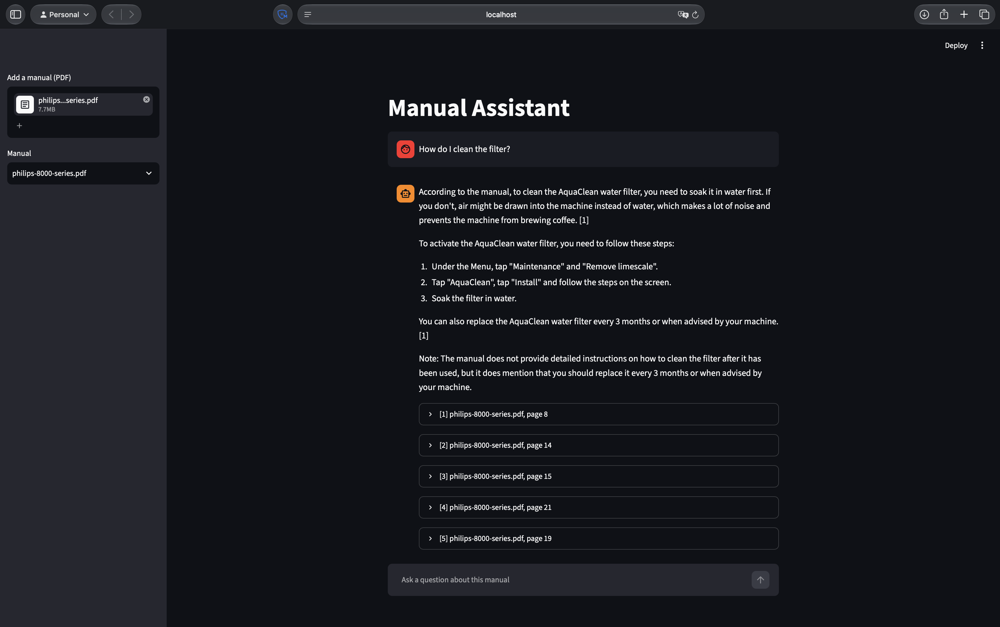

# RAG Doc Assistant
[](https://github.com/juanmeyerb/rag-doc-assistant/actions/workflows/tests.yml)

A local question-answering assistant for technical manuals in PDF format. You select a manual, ask a question in natural language, and get an answer with numbered citations that point to the pages it was taken from. Each cited page can be opened in the browser at the right position. Everything runs on your own machine: the language model, the embedding model and the database. No data leaves the computer.



The project was built and evaluated on five real manuals with a total of 1,291 pages, in up to 30 languages each. The evaluation, the experiments that were tried and dropped, and the known limitations are documented below.

## How it works

The assistant is a retrieval-augmented generation (RAG) pipeline. Indexing a manual and answering a question are two separate stages.

Indexing, done once per manual:

1. PyMuPDF extracts the text of every page. Lines that contain no letters or digits (decorative rows of dots, lone bullet symbols) are removed.
2. Each page becomes one chunk, so every chunk knows its page number, which is what the citation needs.
3. The language of each page is detected with lingua. Pages with fewer than 100 letters are labeled "unknown".
4. The `bge-m3` model turns each page into a vector of 1,024 numbers that represents its meaning.
5. ChromaDB stores the vectors together with the page text, the file name, the page number and the language.

Answering a question:

1. The question is embedded with the same model, and its language is detected.
2. ChromaDB returns the five pages of the selected manual whose vectors are closest to the question (cosine similarity). If the manual contains the question's language, only pages in that language (or "unknown") are searched. If it doesn't, all its pages are searched, so an English question can still be answered from a German-only manual.
3. Two rules decide which pages reach the language model. If the best page scores below 0.55, the assistant replies that the manual doesn't cover the question, without calling the model. Otherwise, pages scoring more than 0.10 below the best one are dropped.
4. `llama3.1:8b` receives the remaining pages, numbered `[1]`, `[2]` and so on, together with instructions to use only these sources, to cite them by number and to answer in the question's language.
5. The app shows the answer and every page that was passed to the model, with its extracted text and a button that opens the PDF at that page.

## Requirements

- At least 16 GB of RAM. Tested on macOS with 16 GB. Ollama, uv and all dependencies also run on Windows and Linux, but the app has not been tested there.
- Python 3.12 and [uv](https://docs.astral.sh/uv/)
- [Ollama](https://ollama.com) with two models: `llama3.1:8b` (about 4.9 GB) and `bge-m3` (about 1.2 GB)

A smaller chat model for 8 GB machines was tested and performed clearly worse (see Evaluation), so 8 GB machines are not supported.

## Setup

```bash
git clone https://github.com/juanmeyerb/rag-doc-assistant.git
cd rag-doc-assistant
uv sync

ollama pull llama3.1:8b
ollama pull bge-m3

uv run streamlit run app.py
```

The app opens at `http://localhost:8501`. Manuals are added with the upload field in the sidebar and are indexed immediately. Alternatively, put PDF files into the `static/` folder and run `uv run python build_index.py`.

Scanned PDFs contain images instead of text and are rejected on upload. They can be converted beforehand with [ocrmypdf](https://ocrmypdf.readthedocs.io), which adds a text layer.

## Command-line tools

| Command | Purpose |
|---|---|
| `uv run python ask.py <manual.pdf> "<question>"` | Answer a question in the terminal |
| `uv run python search.py <manual.pdf> "<question>"` | Show the five closest pages and their scores |
| `uv run python inspect_page.py static/<manual.pdf> <page>` | Show the extracted text of one page |
| `uv run python build_index.py` | Index all PDFs in `static/` |
| `uv run python run_eval.py [model]` | Run the evaluation set |
| `uv run pytest -v` | Run the unit tests |

## Evaluation

The manuals used for testing are not included in this repository, because they are copyrighted by their manufacturers. They were downloaded from the manufacturers' support websites:

| Manual | Pages | Languages |
|---|---|---|
| AVM FRITZ!Box 7530 AX | 269 | English |
| KitchenAid stand mixer | 488 | about 30 |
| Bosch AdvancedDrill 18V-80 / AdvancedImpact 18V-80 | 243 | about 30 |
| Ecovacs DEEBOT T90 Pro Omni | 272 | 9 |
| Dyson cordless vacuum | 19 | German |

`eval_set.py` contains 21 questions, 4 to 6 per manual. For each question, it lists the page that contains the answer and the key facts a correct answer must include. The set covers procedures, values from tables, warnings, troubleshooting, questions in English, German and Spanish, and two questions the manuals do not answer.

`run_eval.py` checks automatically whether the expected page was retrieved and passed to the model. The answers were scored by hand: how many key facts they contain, and how many statements are wrong or not supported by the manual, including wrong citations.

Results of the final configuration (`results/final-21.txt`):

| Measure | Result |
|---|---|
| Expected page among the five retrieved pages | 18 of 19 |
| Expected page passed to the model | 18 of 19 |
| Questions without an answer, stopped before the model | 2 of 2 |
| Key facts in the answers | 30 of 46 |
| Wrong or unsupported statements | 2 |

Repeated runs of the same configuration differ by about one key fact, because the model's output is not fully deterministic even at temperature 0.

## Tests

`tests/test_core.py` covers the deterministic parts of the pipeline: text cleanup, the relevance rules (minimum score and gap), prompt construction and language detection. These tests run on every push through GitHub Actions and need no language model.

The answers themselves depend on two models and are not fully deterministic, so they can't be checked by unit tests. They are covered by the evaluation set described above instead.

## Experiments

Every change was measured against the same questions. The full log with the reasoning behind each decision is in `results/experiments.md`.

| Change | Key facts | Errors | Outcome |
|---|---|---|---|
| Baseline, llama3.1:8b (two runs) | 30–31 of 43 | 1 | kept |
| Prompt rule: include all warnings | 33–34 of 43 | 4–5 | dropped: the model added an unsupported sentence with a citation in both runs |
| qwen3:8b | 32 of 43 | 2 | comparable, not adopted |
| gemma3:4b (for 8 GB machines) | 23 of 43 | 4 | dropped: clearly weaker |
| Markdown extraction with pymupdf4llm | 29–30 of 43 | 1–4 | dropped: fixed step order and tables on some pages, but no overall gain, and one page dropped out of retrieval |
| Prompt: translate everything, flag mismatches | stopped | | dropped: the model invented four cited statements and repeated them |

Some design decisions come from measurements made while building the pipeline:

- Embedding model: with `nomic-embed-text`, an English question scored 0.647 against an English answer but only 0.37 against the same answer in German, barely above unrelated sentences (0.34–0.35). With `bge-m3`, the scores were 0.647 and 0.643.
- Language filter: without it, the five results for "How do I clean the filter?" were the same Ecovacs page in French, English, Danish, Turkish and Norwegian, and the relevant page of the Dyson manual ranked seventh.
- One manual at a time: with several manuals, a question such as "how do I charge the battery?" retrieved pages from three different products, and the model mixed their instructions into one answer.

## Known limitations

- Tables lose their row structure during extraction, so values can be attached to the wrong row. In the evaluation, a torque value was explained with the wrong table row.
- On some pages, the extracted text does not follow the reading order, so steps of a procedure can be missing or out of order in the answer.
- Each page is one chunk. Pages that cover several unrelated topics match any single question less well; one troubleshooting question was not answered for this reason.
- The model sometimes leaves out warnings and conditions, for example "do not exceed speed 2 for yeast doughs".
- When the question's language differs from the manual's, the answer can mix both languages.
- When the manual does not use the term in the question, the model may present the closest procedure as the answer: asked how to change a filter, it described washing it and stated that the filter must be changed monthly.
- The chat history is shown in the app but not sent to the model, so follow-up questions such as "how often should I do that?" are answered without the previous context.
- An answer takes about 10 to 20 seconds on the test machine.

## Project structure

```
app.py            Streamlit interface
chunking.py       PDF text extraction and cleanup, one chunk per page
language.py       language detection
indexing.py       embedding and storing chunks
retrieval.py      search with the language filter
answering.py      relevance rules, prompt and model call
build_index.py    index all PDFs in static/
ask.py            answer a question in the terminal
search.py         show search results in the terminal
inspect_page.py   show the extracted text of a page
eval_set.py       evaluation questions
run_eval.py       evaluation script
results/          evaluation outputs and experiment log
static/           manuals (not included in the repository)
```

## Disclaimer

Answers are generated by a language model and can be incomplete or wrong, as the evaluation above shows. Check important information, especially safety instructions, in the original manual. The software is provided as is, without warranty; see `LICENSE`.